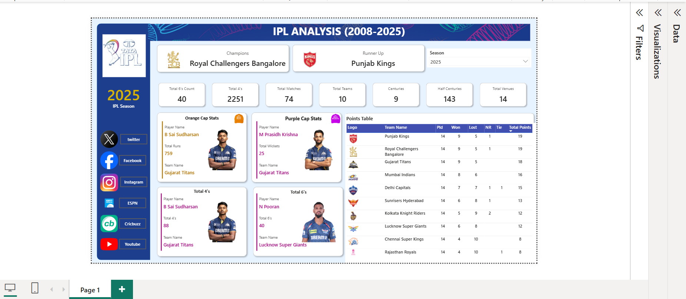

# IPL-Analysis Power BI Dashboard
This repository contains an interactive Power BI dashboard project focused on IPL (Indian Premier League) data analysis. The project explores in-depth statistics about players, teams, match performances, and key insights using powerful data visualizations.

# 📌 Project Objective
To leverage Power BI for visualizing and analyzing historical IPL data to uncover:

Team and player performance trends

Match outcomes

Top scorers and wicket-takers

Venue and toss analysis

Season-wise highlights

# 📊 Key Features
Dynamic Visualizations: Interactive charts, bar graphs, KPIs, and slicers for deeper insights into IPL matches.

Performance Dashboards:

Players Analysis: Top batsmen, bowlers, and all-rounders.

Team Statistics: Win percentages, rivalries, and team-wise breakdowns.

Match Insights: Toss decisions vs match outcomes, venue influence, match winners.

Filter Options: Slice data by year, team, player, or venue to customize insights.

Clean Layout: Organized and user-friendly layout, perfect for business-style reporting or cricket data presentations.

# 📁 Files Included
IPL ANALYSIS.pbix – The Power BI dashboard file.

README.md – Project documentation.

# 🧠 Skills Demonstrated
Power BI data modeling and DAX calculations

Data cleaning and transformation using Power Query

Designing storytelling dashboards for end-user exploration

Sports analytics and performance benchmarking

# 🚀 How to Use
Download and open the .pbix file using Power BI Desktop.

Explore the visualizations using filters/slicers.

Use the report to derive insights on teams, players, and match conditions.

# 📈 Sample Visuals
### 🏏 IPL Dashboard Overview

### 📽️ IPL Dashboard Walkthrough

IPL Dashboard Video [(https://www.youtube.com/watch?v=VIDEO_ID)](https://youtu.be/b5rh3JuxCXA?si=4zLCAY7vGrza5Qxu)

# 📬 Contact
If you'd like to connect or collaborate on sports analytics projects:

Utkarsh Gupta
📧 [utkarshg858@gmail.com]
🔗 https://www.linkedin.com/in/utkarsh-gupta-5a8267208/

